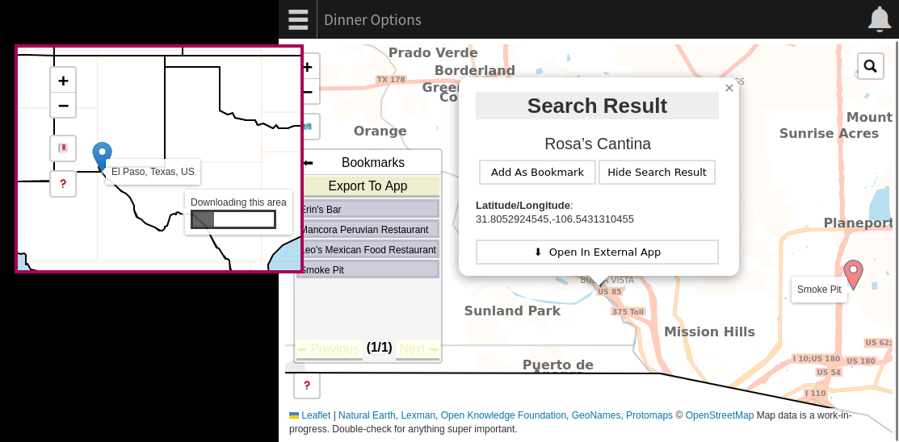
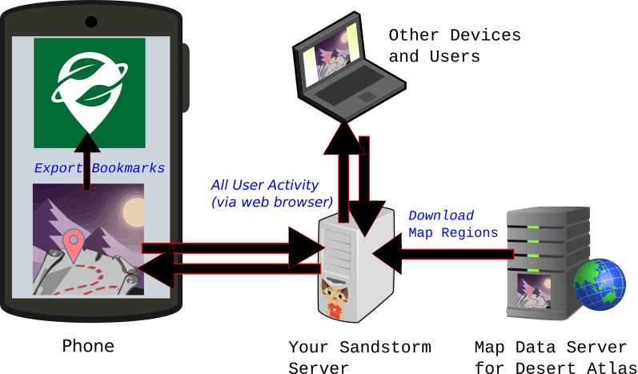

Hello,

This page serves as my Open Source Portfolio. Here, I highlight and give context to some of my own projects as well as contributions made to other projects. If you're looking for the more standard stuff:

* My [LinkedIn](https://www.linkedin.com/in/danielkrol/)
* My [resume](https://danielkrol.com/resume/) (which has my email address)

I've been a Node.js, Go, and Python developer by trade. I'm also a big fan of Haskell, which you'll see below among my personal projects. I've also dipped into some Rust, which I've also included.

# Table Of Contents

* [My Own Projects](#my-own-projects)
  * [Desert Atlas - An OpenStreetMap app for Sandstorm](#desert-atlas---an-openstreetmap-app-for-sandstorm)
  * [Haskell-Synth](#haskell-synth)
  * [Feed Getter (Haskell)](#feed-getter-haskell)
  * [Sntfy (Ntfy package for Sandstorm)](#sntfy-ntfy-package-for-sandstorm-source)
  * [Kiwix package for Sandstorm](#kiwix-package-for-sandstorm)
  * [Fee Fighters - Samurai Python Client](#fee-fighters---samurai-python-client)
* [Open Source Contributions](#open-source-contributions)
  * [Internet-in-a-Box](#internet-in-a-box)
  * [Zulip](#zulip)
  * [LBRY](#lbry)
  * [Etherpad (JavaScript)](#etherpad-javascript)
  * [Etherpad package for Sandstorm](#etherpad-package-for-sandstorm)
* [Exercises/Samples](#exercisessamples)

# My Own Projects

## [Desert Atlas](https://github.com/orblivion/desert-atlas) - An OpenStreetMap app for Sandstorm

This project is a general purpose map web application, aiming to replace the basic functionality of the Google Maps web app the same way that OrganicMaps aims to replace the Google Maps phone app. It's made for a platform called [Sandstorm](https://sandstorm.io). Sandstorm facilitates making easy to manage, private web applications for users who want a simple self-hosting solution.

I [announced the release](https://sandstorm.org/news/2023-12-05-osm-on-sandstorm) on the Sandstorm Community blog. The post includes an extensive technical writeup.

I [also had the great opportunity](https://gis.harvard.edu/event/desert-atlas-self-hosted-collaborative-online-map-easy-and-private) to present about it at the Center for Geographic Analysis at Harvard.

The application allows users to collaborate by adding bookmark markers to the map. Say, for planning a vacation. Each user can then export the result and import it for use on their OpenStreetMap app on their phone (OrganicMaps, OSMAnd, etc) for navigation. Desert Atlas facilitates privacy: the only entities with access to the data are the specific users of a given map, the Sandstorm administrator, and whoever owns the hardware Sandstorm is running on.

Desert Atlas is able to be private because it's _fully_ self-hosted: all of the tiles are stored on the server (after downloading map data _once_ per map from an external source). By contrast, many OSM apps are not fully self-hosted, and will still call to openstreetmap.org for tiles. Compared to the OSM apps that _are_ fully self-hosted, Desert Atlas is much simpler. It uses Protomaps for the tiles (much smaller) and a simple search backend (sqlite3 with fts5 as of this writing). The usual OSM stack requires postgresql for tiles and elasticsearch for search. As a result, it plays nicely with Sandstorm (which favors simple self-contained apps), and makes for an easy point-and-click experience for users, similar to a phone app, from app installation to map data download to map editing.

## [Haskell-Synth](https://github.com/orblivion/Haskell-Synth)

An attempt to make a Sound/Music synthesizer, in Haskell. It generates a simple sequence of electronic music out of raw wave forms based on hard coded instructions:

[&#128266; Rhythm](https://github.com/orblivion/Haskell-Synth/blob/master/example-output/beat.ogg?raw=true)

[&#128266; Sound effect](https://github.com/orblivion/Haskell-Synth/blob/master/example-output/example.ogg?raw=true)

It really sold me on Haskell, as I made some really sophisticated refactors and the compiler kept me in check to an astounding degree.

## [Feed Getter (Haskell)](https://github.com/orblivion/feedGetter)

A Podcast downloader written in Haskell that takes advantage of Haskell's async paradigm. (No UI; I prefer to use my existing audio players)

## [Sntfy (Ntfy package for Sandstorm)](https://apps.sandstorm.io/app/c6rk81r4qk6dm3k04x1kxmyccqewhh4npuxeyg1xrpfypn2ddy0h) ([source](https://github.com/orblivion/ntfy/tree/sandstorm/.sandstorm))

[Ntfy](https://ntfy.sh) is a self-hosted push notification service and Android app created by Philipp Heckel. The user connects their ntfy Android app to the ntfy service of their choice (either a public server, or self-hosted). Other services can then send notifications to the user by POSTing to the ntfy service.

[Sandstorm](https://sandstorm.org) is my favorite self-hosted web application platform. It makes self-hosting easy for the apps that are packaged for it. I wanted to let users manage their own push notifications on Sandstorm, so I created a package for ntfy.

### Why ntfy

Ntfy is good for two main things:

Firstly, those who try to "de-Google" their Android or GrapheneOS phone run into a dilemma when it comes to push notifications for their apps. The usual way is to rely on Firebase Cloud Messaging (i.e. Google), which is supplied by the system. There is now an alternative system called [UnifiedPush](https://unifiedpush.org/) that delivers push notifications for a limited number of applications, including Tusky (for Mastodon) and Element (for Matrix). ntfy is one a few systems that implement UnifiedPush.

Secondly, it may be useful to receive push notifications for web apps that don't necessarily have an accompanying phone app. For instance, [Changedetection.io](https://changedetection.io/) can alert you when a web page changes. Setting up this type of integration is very simple. Users will often even create their own home scripts that fire off notifications.

### Sandstorm Integration

Sandstorm is very locked down, which can complicate porting of applications. Getting ntfy to work on a basic level on Sandstorm was straightforward. However, some ntfy features don't work with Sandstorm because they use custom HTTP headers that Sandstorm currently does not pass through. Most of my time was spent on investigating these and other incompatibilities with Sandstorm, removing them from the web UI, and warning the user about them.

The one web UI change that was necessary to make ntfy work with Sandstorm was to add the "offer template", which is Sandstorm's way of giving users an API token. Using an offer template makes it a more uniform Sandstorm experience with other apps. Sandstorm API tokens can also be revoked, which is useful in case of a misbehaving integration.

Finally, I elected to to add an on-boarding section to the web UI. I felt that ntfy could benefit from it, particularly because there are a few moving parts in the system to understand. Perhaps ntfy upstream would consider implementing something like this.

### What comes next

Users can now easily host ntfy alongside their other Sandstorm applications. However what comes next is what's most exciting.

If somebody wants to create a Sandstorm package with a ntfy integration (such as Changedetection.io, which is also self-hostable), the user could conveniently host it alongside ntfy right on their Sandstorm server. They would need to copy the ntfy API token to the other app, which is a little cumbersome. But we could improve on this. Sandstorm has the ability to integrate apps together through its user interface with a feature called the "powerbox". The user would be able to connect the apps together through a simple menu. Developing for the powerbox will take me some time to learn, however.

Some other ideas I have:

On-boarding is a big block of text. I'd like to improve it by making it more interactive and only showing pertinent information.

The standard ntfy server has its own way of locking down, but it requires CLI configuration which isn't possible on Sandstorm. What is possible, however, is to give Sandstorm API tokens a limited scope. My hope is to leverage this to offer similar control to users right in the web UI.

I would also like to try to add back some of the other missing features, such image attachments.

Finally, I would like to add a dashboard to the web UI to allow the user to monitor their activity. This would not make sense in the standard version of ntfy because it's meant to be a public server.

## [Kiwix package for Sandstorm](https://github.com/orblivion/KiwixSandstorm)

This project is to package an application called [Kiwix](https://www.kiwix.org) for a platform called [Sandstorm](https://sandstorm.io). Neither Kiwix nor Sandstorm per se are my own work.

Kiwix makes it easy to have your own copy of Wikipedia and many other open data sites. However, as with any self-hosted web\* application, it requires a small amount of maintenance to set up and maintain. Sandstorm is a platform that greatly reduces maintenance of running self-hosted applications. Here it is [listed on the Sandstorm Marketplace](https://apps.sandstorm.io/app/5uh349d0kky2zp5whrh2znahn27gwha876xze3864n0fu9e5220h). Sandstorm is a very restrictive environment and requires some work to configure an application to work with it. Once it does, though, it has the benefits of simplicity of maintenance, security, and even some interoperability with other applications.

This is mostly a packaging/building exercise, and I helped Kiwix identify some [build errors](https://github.com/kiwix/kiwix-lib/issues/44) and even a [licensing problem](https://github.com/openzim/libzim/issues/30) along the way. It is also in part a development exercise, as it includes a custom uploader that played well with Sandstorm, though it was rather hacked together and is not the greatest example of my work as a developer per se. In particular, I needed to handle large files in a novel way as Sandstorm at the time did not support proper Range requests.

\* Kiwix also comes as a phone and desktop application

## [Fee Fighters - Samurai Python Client](https://github.com/orblivion/samurai-client-python/tree/demo)

The initial version of the Python client for the Samurai api created by FeeFighters (now part of Groupon). I created this while working for Alltuition in 2011, where we were using FeeFighters to process payments. I should note that this is early in my Python days, and I've improved my style since then. (Though, you'll see I did a cleanup pass of this code in 2016).

# Open Source Contributions

## [Internet-in-a-Box](https://internet-in-a-box.org)

Internet-in-a-Box is a customizable self-hosted digital library made for cheap hardware in zero-connectivity environments. It is featured in the [Wikipedia store](https://store.wikimedia.org/products/internet-in-a-box), though users typically set up their own. IIAB is designed for educational settings in parts of the world with limited resources. A common setup is installing on a 256GB SD card on a Raspberry Pi 3. However, IIAB aims to keep its main functionality working on a Raspberry Pi Zero 2 W which has only 512MB of RAM. IIAB is designed to be customizable because users often need to decide how to use their limited disk space: Wikipedia, Khan Academy, OpenStreetMap, etc?

I was brought on board to create the new version of the [IIAB Maps](https://github.com/iiab/iiab/tree/master/roles/maps) application. It started off as a basic packaging of [maps.black](https://maps.black) which includes OpenStreetMap, satellite, and terrain. This part only includes the tiles, i.e. the visible part, no search or navigation (yet). I opted for the pmtiles format (rather than mbtiles) because it can be served statically using Nginx directly. This is less work on the server side, which makes it work reasonably well even on the Zero 2 W.

From there I added a couple features to allow users to trade off detail for disk space. Firstly, I added installation options to allow users to select between a few different maximum zoom levels for their world map data downloads. After that, I implemented a feature called "Full Quality Regions" that allows the user to download a part of the map at full quality even if they chose a smaller file for the full planet.

With that in place, we wanted to see if we could include something useful for search as well. I initally tried including Nominatim, which is the default search engine for OpenStreetMap. It uses psql for the back end usually, but I went with an experimental option that uses sqlite3. It worked okay on a Raspberry Pi 500, but on the Zero 2 W it was nearly unusable for a large data set. So what to try next? I could have hacked together something simple using an sqlite3 database, but I wanted to try a radical approach. Since the Zero 2 W functions well with statically served map tiles (i.e. very little work on the back end), I looked for ways to statically host a search engine. I found a project online that had a proof of concept and adapted it to our needs. It turns out to be quite simple: a directory of json files where the first 3 letters of any search token in a search result will determine which json file it goes into. For instance, "New York" will be found in `new.json` and `yor.json`. For 165k cities, this works quite well (and I have ideas for making a much larger search index). You can see the database import script [here](https://github.com/iiab/maps2/tree/92ecf3fe679e9579253fc72bc3d372f74bd85353/build-databases/static) and the front end code that uses it [here](https://github.com/iiab/iiab/blob/c3a6b45090c4cd446f5c4fa653578a451ad59aaf/roles/maps/files/static_search.js).

## Zulip

[Zulip](https://zulip.com) is chat platform for organizations, competing with Slack and Discord. It's especially great for open source because channels can be made public and searchable, like a mailing list.

Zulip has great developer tools and onboarding documentation. Accompanying that, it has strict guidelines for things like commit messages, linting, and test coverage.

### [Avatar upload UI broken when blocking Gravatar](https://github.com/zulip/zulip/issues/19123)

As of this writing this issue is assigned to me. Since this was my first contribution to Zulip, I split it into three pull requests to keep it simpler. So far this one PR is merged (and [released](https://blog.zulip.com/2025/08/13/zulip-11-0-released/)!)

* [(zulip/zulip#34370) Handle gravatar domain blocked for navbar avatar](https://github.com/zulip/zulip/pull/34370)

## LBRY

I've done some work for [LBRY](https://lbry.com/) on a contract basis.

### Wallet Sync Server

My main contribution was a self-hosted server written in Go that allows users to synchronize their LBRY wallets between multiple clients. Unfortunately LBRY as a company went under before we had a chance to implement it in any clients.

This is different from most servers in that the important user data (the wallet) needs to be encrypted. The server has no insight about the data with which to reconcile concurrent changes from multiple clients. Without careful planning, a client could (however rarely) overwrite a change created by another client, leading to data loss (private keys!). Every client needs to download the latest version from the server before applying new changes and pushing it back. This is enforced with a "sequence" number for wallets. There's also the potential for hostile actors. We ideally don't want to trust anything other than the clients. As such, the sequence numbers along with encrypted wallets are cryptographically signed by clients so that other clients can trust them.

[https://github.com/lbryio/wallet-sync-server/](https://github.com/lbryio/wallet-sync-server/)

Once support is added to clients, I (or whoever is in charge of the server) will go back and consider more edge cases. Before I started coding, I started writing some diagrams thinking about various edge case scenarios. The diagrams are not complete; we decided to make an initial version of the code so we had some practical experience before spending more time on the theoretical. That said, here's one of the documents I started to give an idea of what I was considering:

[https://github.com/orblivion/lbry-wallet-sync-draft/blob/master/spec/sync.md](https://github.com/orblivion/lbry-wallet-sync-draft/blob/master/spec/sync.md)

### LBRY transactions in the browser

One interesting side project I did, where I dug into some blockchain internals, was to create a proof-of-concept fork of a Bitcoin library in TypeScript/JavaScript that would work with LBRY. LBRY is a fork of Bitcoin with three new opcodes and some different constants. I then used this library to make a demo of creating LBRY transactions in the browser.

You can [see my changes here](https://github.com/orblivion/bitcoinjs-lib/compare/11202eb74cc9d9a7338ef4aa04c78061f0544289..ae14ef1355d2d8bb3e9aca98a01201d279e085bf).

## Etherpad (JavaScript)

I've done some work for the Etherpad project on a contract basis. I will point to a few particular pull requests:

### [Fixing WebRTC Error Messages](https://github.com/ether/ep_webrtc/pull/36/)

This is for a WebRTC plugin that let document editors have an A/V chat. The error messages for making the connection were wrong. While investigating I realized that there were some rather jarring changes in the webrtc spec as far as error messages go. Errors that are thrown changed meanings over time. One error condition actually changed from throwing an Error to making the function `undefined`. This requires us to do ridiculous introspection to have a best guess as to what an error exactly means, in a way that works across all browsers we wish to support.

That said, understanding as I do now about adapter.js, I would probably have tried updating that instead of putting those changes in the Polyfill.

### [Fix color picker bug](https://github.com/ether/etherpad-lite/pull/3730)

Fix a bug with the color picker for the user's representation in a collaborative document. The change itself is one line, but the test is a lot more.

### [Fix clearing cookies in tests](https://github.com/ether/etherpad-lite/pull/3775)

While running the test suite, I found that cookies were not resetting properly, creating the possibility of false positives for passing tests. This change includes a fix for it, as well as a test for it (even though it is itself a test helper function).

### README updates developer testing instructions for WebRTC [on localhost](https://github.com/ether/ep_webrtc/pull/32) and [with SSL](https://github.com/ether/ep_webrtc/pull/42/files)

A couple minor documentation examples, again on the WebRTC plugin. It was my first time working with WebRTC and there was some ramp-up time trying to sort out why certain errors were occurring. I wanted to try to speed that part along for the next person.

## [Etherpad package for Sandstorm](https://github.com/sandstormports/etherpad-lite-sandstorm)

Given my experience working on Etherpad, I was commissioned to upgrade the Etherpad package for a platform called [Sandstorm](https://sandstorm.io) (Sandstorm per se is not my own work).

There had been an existing Sandstorm package for Etherpad, but it was a few years old. We decided that it would be easier for me to make the new package from scratch, even though it amounted to copying most of the Sandstorm-specific changes from the previous package. However, since Etherpad itself had updated over the years, some of those Sandstorm-specific changes took quite some time to figure out how to adapt properly.

Since my last commit in March 2022, others have made changes and released updates. You can see the public discussion about my part [here](https://github.com/sandstormports/community-project/issues/15).

## [Dashsee - Dash interface for Odysee/LBRY](https://github.com/orblivion/dashsee-mvp)

Angular / Typescript

Dashsee ("Dash" + "Odysee") was an attempt to allow holders of the Dash cryptocurrency to interact with the LBRY system in an interface similar to Odysee. The backend of it didn't pan out, but I made a simple frontend that copies the (very) basic browsing capabilities of Odysee.

# Exercises/Samples
### [Golang - A coding test](https://github.com/orblivion/ignite-invasion)
### [Python - A file import plugin for Inkscape (as a coding test)](https://github.com/orblivion/hpgl-coding-test)
### [Python - A coding test](https://github.com/orblivion/hellolabs_word_test)
### [Erlang (without OTP) - A simple chat program](https://github.com/orblivion/erlang_chat_exercise)
### [Haskell - A Markov chain, or something like it](https://github.com/orblivion/random-chain)
### [Rust - Advent of Code 2022 (first 11 days)](https://github.com/orblivion/aoc-2022)
### [Rust - Pull Request to SquireCore, part of a Magic The Gathering tournament manager](https://github.com/SquireTournamentServices/SquireCore/pull/202)

This project was written with the actor model. The maintainer pulled out the actor model stuff into its own package and tasked me with integrating it back into the main project as an imported library. The library wasn't identical to what was in the main package, so I had to figure out how to adjust the project code to fit.

It hasn't been merged because the maintainer had to resolve some conflicts and I think has not gotten around to it.

I have played more with Haskell than Rust, and I feel that my experience with Haskell gave me very useful instincts for navigating the weird type level issues here.
