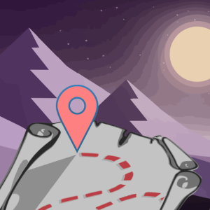

Hello,

This page serves as my Open Source Portfolio. Here, I highlight and give context to some of my own projects as well as contributions made to other projects. If you're looking for the more standard stuff:

* My [LinkedIn](https://www.linkedin.com/in/danielkrol/)
* My [resume](https://danielkrol.com/resume/) (which has my email address)

I've been a Node.js, Go, and Python developer by trade. I'm also a big fan of Haskell, which you'll see below among my peronal projects. I've also dipped into some Rust, which I've also included.

# Table Of Contents

* [My Own Projects](#my-own-projects)
  * [Desert Atlas (Formerly Share-A-Map) - An OpenStreetMap app for Sandstorm](#desert-atlas-formerly-share-a-map---an-openstreetmap-app-for-sandstorm)
  * [Haskell-Synth](#haskell-synth)
  * [Feed Getter (Haskell)](#feed-getter-haskell)
  * [Fee Fighters - Samurai Python Client](#fee-fighters---samurai-python-client)
  * [Kiwix package for Sandstorm](#kiwix-package-for-sandstorm)
* [Open Source Contributions](#open-source-contributions)
  * [LBRY](#lbry)
  * [Etherpad (JavaScript)](#etherpad-javascript)
  * [Etherpad package for Sandstorm](#etherpad-package-for-sandstorm)
* [Exercises/Samples](#exercisessamples)

# My Own Projects

## [Desert Atlas (Formerly Share-A-Map)](https://github.com/orblivion/sandstorm-share-a-map) - An OpenStreetMap app for Sandstorm

This project is a general purpose map web application, aiming to replace the basic functionality of the Google Maps web app the same way that OrganicMaps aims to replace the Google Maps phone app. It's made for a platform called [Sandstorm](https://sandstorm.io). Sandstorm facilitates making easy to manage, private web applications for users who want a simple self-hosting solution.

I [announced the release](https://sandstorm.org/news/2023-12-05-osm-on-sandstorm) on the Sandstorm Community blog. The post includes an extentsive technical writeup.

I [also had the great opportunity](https://gis.harvard.edu/event/desert-atlas-self-hosted-collaborative-online-map-easy-and-private) to present about it at the Center for Geograhic Analysis at Harvard.

The application allows users to collaborate by adding bookmark markers to the map. Say, for planning a vacation. Each user can then export the result and import it for use on their OpenStreetMap app on their phone (OrganicMaps, OSMAnd, etc) for navigation. Desert Atlas facilitates privacy: the only entities with access to the data are the specific users of a given map, the Sandstorm administrator, and whoever owns the hardware Sandstorm is running on.

Desert Atlas is able to be private because it's _fully_ self-hosted: all of the tiles are stored on the server (after downloading map data _once_ per map from an external source). By contrast, many OSM apps are not fully self-hosted, and will still call to openstreetmap.org for tiles. Compared to the OSM apps that _are_ fully self-hosted, Desert Atlas is much simpler. It uses Protomaps for the tiles (much smaller) and a simple search backend (sqlite3 with fts5 as of this writing). The usual OSM stack requires postgresql for tiles and elasticsearch for search. As a result, it plays nicely with Sandstorm (which favors simple self-contained apps), and makes for an easy point-and-click experience for users, similar to a phone app, from app installation to map data download to map editing.

## [Haskell-Synth](https://github.com/orblivion/Haskell-Synth)

An attempt to make a Sound/Music synthesizer, in Haskell. It generates a simple sequence of electronic music out of raw wave forms based on hard coded instructions. [Like this](https://github.com/orblivion/Haskell-Synth/blob/master/example-output/beat.ogg?raw=true) or [this](https://github.com/orblivion/Haskell-Synth/blob/master/example-output/example.ogg?raw=true).

It really sold me on Haskell, as I made some really sophisticated refactors and the compiler kept me in check to an astounding degree.

## [Feed Getter (Haskell)](https://github.com/orblivion/feedGetter)

A Podcast downloader written in Haskell that takes advantage of Haskell's async paradigm. (No UI; I prefer to use my existing audio players)

## [Fee Fighters - Samurai Python Client](https://github.com/orblivion/samurai-client-python/tree/demo)

The initial version of the Python client for the Samurai api created by FeeFighters (now part of Groupon). I created this while working for Alltuition in 2011, where we were using FeeFighters to process payments. I should note that this is early in my Python days, and I've improved my style since then. (Though, you'll see I did a cleanup pass of this code in 2016).

## [Kiwix package for Sandstorm](https://github.com/orblivion/KiwixSandstorm)

This project is to package an application called [Kiwix](https://www.kiwix.org) for a platform called [Sandstorm](https://sandstorm.io). Neither Kiwix nor Sandstorm per se are my own work.

Kiwix makes it easy to have your own copy of Wikipedia and many other open data sites. However, as with any self-hosted web\* application, it requires a small amount of maintenance to set up and maintain. Sandstorm is a platform that greatly reduces maintenance of running self-hosted applications. Here it is [listed on the Sandstorm Marketplace](https://apps.sandstorm.io/app/5uh349d0kky2zp5whrh2znahn27gwha876xze3864n0fu9e5220h). Sandstorm is a very restrictive environment and requires some work to configure an application to work with it. Once it does, though, it has the benefits of simplicity of maintenance, security, and even some interoperability with other applications.

This is mostly a packaging/building exercise, and I helped Kiwix identify some [build errors](https://github.com/kiwix/kiwix-lib/issues/44) and even a [licensing problem](https://github.com/openzim/libzim/issues/30) along the way. It is also in part a development exercise, as it includes a custom uploader that played well with Sandstorm, though it was rather hacked together and is not the greatest example of my work as a developer per se. In particular, I needed to handle large files in a novel way as Sandstorm at the time did not support proper Range requests.

\* Kiwix also comes as a phone and desktop application

# Open Source Contributions

## LBRY

I've done some work for [LBRY](https://lbry.com/) on a contract basis. My main contribution thus far has been a self-hosted server written in Go that allows users to synchronize their LBRY wallets between multiple clients. As of this writing, the wallet sync project overall is in progress, and it hasn't been implemented in any LBRY clients yet.

This is different from most servers in that the important user data (the wallet) needs to be encrypted. The server has no insight about the data with which to reconcile concurrent changes from multiple clients. Without careful planning, a client could (however rarely) overwrite a change created by another client, leading to data loss (private keys!). Every client needs to download the latest version from the server before applying new changes and pushing it back. This is enforced with a "sequence" number for wallets. There's also the potential for hostile actors. We ideally don't want to trust anything other than the clients. As such, the sequence numbers along with encrypted wallets are cryptographically signed by clients so that other clients can trust them.

[https://github.com/lbryio/wallet-sync-server/](https://github.com/lbryio/wallet-sync-server/)

Once support is added to clients, I (or whoever is in charge of the server) will go back and consider more edge cases. Before I started coding, I started writing some diagrams thinking about various edge case scenarios. The diagrams are not complete; we decided to make an initial version of the code so we had some practical experience before spending more time on the theoretical. That said, here's one of the documents I started to give an idea of what I was considering:

[https://github.com/orblivion/lbry-wallet-sync-draft/blob/master/spec/sync.md](https://github.com/orblivion/lbry-wallet-sync-draft/blob/master/spec/sync.md)

## Etherpad (JavaScript)

I've done some work for the Etherpad project on a contract basis. I will point to a few particular pull requests:

### [Fixing WebRTC Error Messages](https://github.com/ether/ep_webrtc/pull/36/)

This is for a WebRTC plugin that let document editors have an A/V chat. The error messages for making the connection were wrong. While investigating I realized that there were some rather jarring changes in the webrtc spec as far as error messages go. Errors that are thrown changed meanings over time. One error condition actually changed from throwing an Error to making the function `undefined`. This requires us to do ridiculous introspection to have a best guess as to what an error exactly means, in a way that works across all browsers we wish to support.

That said, understanding as I do now about adapter.js, I would probably have tried updating that instead of putting those changes in the Polyfill.

### [Fix color picker bug](https://github.com/ether/etherpad-lite/pull/3730)

Fix a bug with the color picker for the user's representation in a collaborative document. The change itself is one line, but the test is a lot more.

### [Fix clearing cookies in tests](https://github.com/ether/etherpad-lite/pull/3775)

While running the test suite, I found that cookies were not resetting properly, creating the possibility of false positives for passing tests. This change includes a fix for it, as well as a test for it (even though it is itself a test helper function).

### README updates developer testing instructions for WebRTC [on localhost](https://github.com/ether/ep_webrtc/pull/32) and [with SSL](https://github.com/ether/ep_webrtc/pull/42/files)

A couple minor documentation examples, again on the WebRTC plugin. It was my first time working with WebRTC and there was some ramp-up time trying to sort out why certain errors were occurring. I wanted to try to speed that part along for the next person.

## [Etherpad package for Sandstorm](https://github.com/sandstormports/etherpad-lite-sandstorm)

Given my experience working on Etherpad, I was commissioned to upgrade the Etherpad package for a platform called [Sandstorm](https://sandstorm.io) (Sandstorm per se is not my own work).

There had been an existing Sandstorm package for Etherpad, but it was a few years old. We decided that it would be easier for me to make the new package from scratch, even though it amounted to copying most of the Sandstorm-specific changes from the previous package. However, since Etherpad itself had updated over the years, some of those Sandstorm-specific changes took quite some time to figure out how to adapt properly.

Since my last commit in March 2022, others have made changes and released updates. You can see the public discussion about my part [here](https://github.com/sandstormports/community-project/issues/15).

## [Dashsee - Dash interface for Odysee/LBRY](https://github.com/orblivion/dashsee-mvp)

Angular / Typescript

Dashsee ("Dash" + "Odysee") was an attempt to allow holders of the Dash cryptocurrency to interact with the LBRY system in an interface similar to Odysee. The backend of it didn't pan out, but I made a simple frontend that copies the (very) basic browsing capabilities of Odysee.

# Exercises/Samples
### [Golang - A coding test](https://github.com/orblivion/ignite-invasion)
### [Python - A file import plugin for Inkscape (as a coding test)](https://github.com/orblivion/hpgl-coding-test)
### [Python - A coding test](https://github.com/orblivion/hellolabs_word_test)
### [Erlang (without OTP) - A simple chat program](https://github.com/orblivion/erlang_chat_exercise)
### [Haskell - A Markov chain, or something like it](https://github.com/orblivion/random-chain)
### [Rust - Advent of Code 2022 (first 11 days)](https://github.com/orblivion/aoc-2022)
### [Rust - Pull Request to SquireCore, part of a Magic The Gathering tournament manager](https://github.com/SquireTournamentServices/SquireCore/pull/202)

This project was written with the actor model. The maintainer pulled out the actor model stuff into its own package and tasked me with integrating it back into the main project as an imported library. The library wasn't identical to what was in the main package, so I had to figure out how to adjust the project code to fit.

It hasn't been merged because the maintainer had to resolve some conflicts and I think has not gotten around to it.

I have played more with Haskell than Rust, and I feel that my experience with Haskell gave me very useful instincts for navigating the weird type level issues here.
